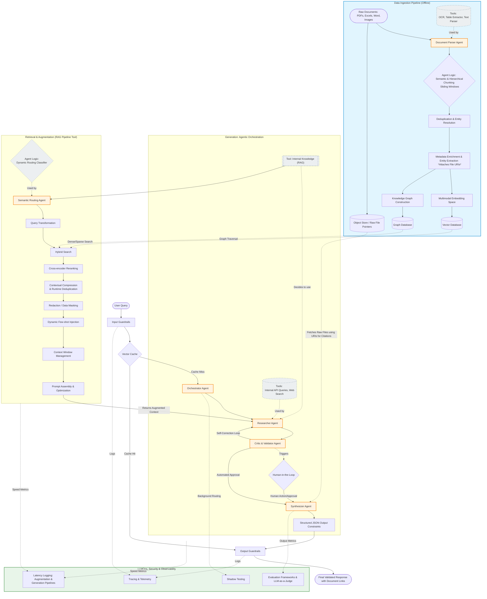

```mermaid
graph TD
    %% Styling
    classDef offline fill:#e1f5fe,stroke:#0288d1,stroke-width:2px;
    classDef runtime fill:#f3e5f5,stroke:#8e24aa,stroke-width:2px;
    classDef ops fill:#e8f5e9,stroke:#388e3c,stroke-width:2px;
    classDef agent fill:#fff3e0,stroke:#f57c00,stroke-width:2px;
    classDef tools fill:#eceff1,stroke:#607d8b,stroke-width:1px,stroke-dasharray: 5 5;

    User([User Query]) --> InputGuard[Input Guardrails]
    
    %% --- OFFLINE INGESTION PIPELINE ---
    subgraph Offline_Ingestion ["Data Ingestion Pipeline (Offline)"]
        RawDocs([Raw Documents: <br> PDFs, Excels, Word, Images]) --> ParserAgt[Document Parser Agent]
        
        ParserTools[("Tools: <br> OCR, Table Extractor, Text Parser")] -. Used by .-> ParserAgt
        class ParserTools tools
        
        ParserAgt --> ChunkLogic{"Agent Logic: <br> Semantic & Hierarchical Chunking <br> Sliding Windows"}
        ChunkLogic --> Dedupe[Deduplication & Entity Resolution]
        Dedupe --> Meta[Metadata Enrichment & Entity Extraction <br> *Attaches File URIs*]
        
        %% Parallel processing
        Meta --> Embed[Multimodal Embedding Space]
        Meta --> KG[Knowledge Graph Construction]
        
        %% Database Routing
        Embed --> VectorDB[(Vector Database)]
        KG --> GraphDB[(Graph Database)]
        RawDocs --> BlobDB[(Object Store / Raw File Pointers)]
    end
    class Offline_Ingestion offline
    class ParserAgt agent

    %% --- RUNTIME: ORCHESTRATION & TOOL CALLING ---
    InputGuard --> Cache{Vector Cache}
    Cache -- Cache Hit --> OutputGuard
    Cache -- Cache Miss --> OrchestratorAgt[Orchestrator Agent]

    subgraph Runtime_Generation ["Generation: Agentic Orchestration"]
        OrchestratorAgt --> ResearchAgt[Researcher Agent]
        
        %% Tools strictly for fetching info
        ExternalTools[("Tools: <br> Internal API Queries, Web Search")] -. Used by .-> ResearchAgt
        RAGTool[["Tool: Internal Knowledge (RAG)"]] -. Decides to use .-> ResearchAgt
        class ExternalTools,RAGTool tools
        
        %% Validation and Synthesis flow
        ResearchAgt --> CriticAgt[Critic & Validator Agent]
        CriticAgt -- Self-Correction Loop --> ResearchAgt
        
        CriticAgt -. Triggers .-> HITL{Human-in-the-Loop}
        HITL -- "Human Action/Approval" --> SynthAgt[Synthesizer Agent]
        
        CriticAgt -- "Automated Approval" --> SynthAgt
        SynthAgt --> StructOut[Structured JSON Output Constraints]
    end
    class Runtime_Generation runtime
    class OrchestratorAgt,ResearchAgt,CriticAgt,SynthAgt agent

    %% --- RUNTIME: THE RAG PIPELINE (Triggered by Tool) ---
    subgraph Runtime_RAG ["Retrieval & Augmentation (RAG Pipeline Tool)"]
        RouterAgt[Semantic Routing Agent]
        
        RouterLogic{"Agent Logic: <br> Dynamic Routing Classifier"} -. Used by .-> RouterAgt
        class RouterLogic tools
        
        RouterAgt --> QueryTrans[Query Transformation]
        QueryTrans --> Search[Hybrid Search]
        
        VectorDB -. Dense/Sparse Search .-> Search
        GraphDB -. Graph Traversal .-> Search
        
        Search --> Rerank[Cross-encoder Reranking]
        Rerank --> Compress[Contextual Compression <br> & Runtime Deduplication]
        
        Compress --> Redact[Redaction / Data Masking]
        Redact --> FewShot[Dynamic Few-shot Injection]
        FewShot --> CtxWindow[Context Window Management]
        CtxWindow --> PromptOpt[Prompt Assembly & Optimization]
    end
    class Runtime_RAG runtime
    class RouterAgt agent

    %% Connecting the Tool to the Pipeline, and Pipeline back to Agent
    RAGTool --> RouterAgt
    PromptOpt -- "Returns Augmented Context" --> ResearchAgt

    %% Output and Citations
    BlobDB -. "Fetches Raw Files using URIs for Citations" .-> SynthAgt
    StructOut --> OutputGuard[Output Guardrails]
    OutputGuard --> Final([Final Validated Response with Document Links])

    %% --- CROSS-CUTTING: LLOps & SECURITY ---
    subgraph LLMOps ["LLMOps, Security & Observability"]
        Telemetry[Tracing & Telemetry]
        SpeedMetrics[Latency Logging: <br> Augmentation & Generation Pipelines]
        Eval[Evaluation Frameworks & LLM-as-a-Judge]
        Shadow[Shadow Testing]
    end
    class LLMOps ops

    %% Ops Connections
    InputGuard -. Logs .-> Telemetry
    OutputGuard -. Logs .-> Telemetry
    Runtime_RAG -. Speed Metrics .-> SpeedMetrics
    Runtime_Generation -. Speed Metrics .-> SpeedMetrics
    SynthAgt -. Output Metrics .-> Eval
    OrchestratorAgt -. Background Routing .-> Shadow

```